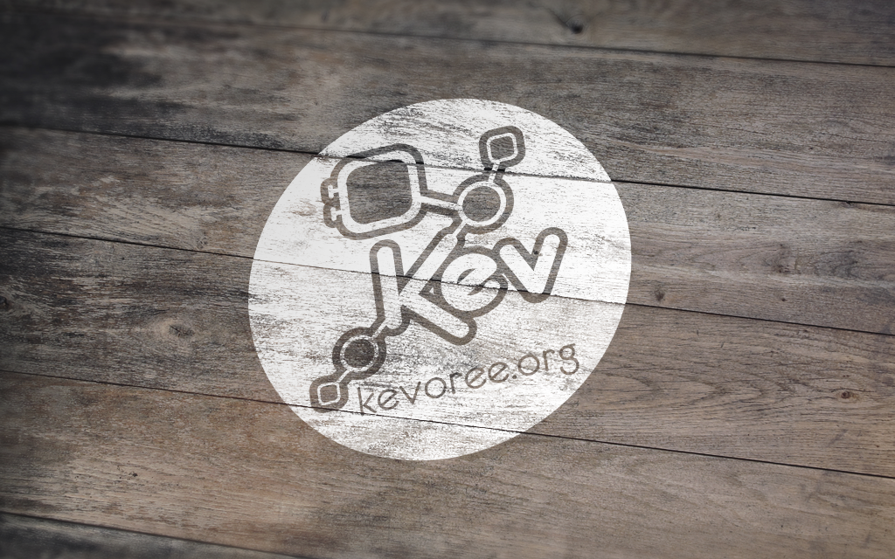

The Kevoree Book
============

### Why Kevoree?
Adaptive systems are complex! Even more when they are distributed!

The Models@Run.time strategy adopted by Kevoree aims at offering a clean, safer and simpler way to interact with distributed systems. Using models first, Kevoree allows users to define complex adaptations easily, to build for instance self-healing systems. Extensible, this project already offers runtime for JVM, Android, Arduino and Javascript, but also for virtualization management such as VirtualBox. In short, Kevoree is helping you to develop your heterogeneous, distributed and adaptive software from Cloud stacks to embedded devices!

### What is it?
Build around a component model, Kevoree leverages the model@runtime paradigm to offer tools to build, adapt and synchronize distributed systems.

### Where it is?
Kevoree main website can be found at: http://kevoree.org

Kevoree sources can be found at: http://git.kevoree.org

### Who?
The development of Kevoree is currently supported by:

1. University of Luxembourg
2. Interdisciplinary Center for Security, Reliability and Trust (SnT), Luxembourg
3. University of Rennes 1
4. INRIA Rennes Bretagne-Attlantique

The development of Kevoree is (or has been) funded by the following projects:

1. [EU FP7 HEADS](http://heads-project.eu)

