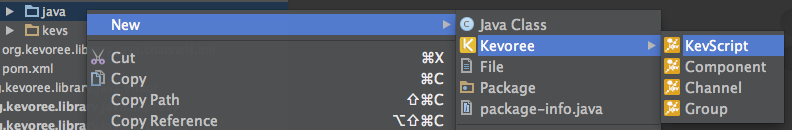

# Create a new Kevoree entity

First of all, Kevoree new wizard only work when a source repository is selected.
So naviguate to ***src** directory of your project (plain Java or Kevoree) for instance and right click on it.

### Create a Component / Channel / Group

* Right click on source directory
* Select Kevoree sub menu
* Create a Component / Channel / Group

Additionally, each sequeleton of Kevoree entity generated by the plugin contains Kevoree API usage example. Thus, don't hesitate to use them if you don't remember the API to access Models@Run.time for instance.

### Create a KevScript

* Right click on source directory
* Select Kevoree sub menu
* Create a KevScript

KevScript files describe namely a boot file. In other word to define and run a Kevoree the easiest way is to define such file and run it using runnner of the next sub-section.
