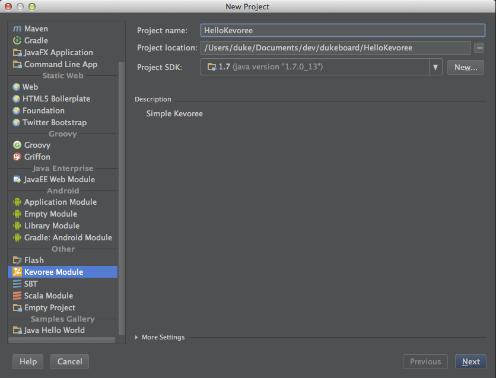

# Create a new project (Wizards)

The Kevoree plugin provide several wizards to make your life easier to create new project.

* Naviguate to menu NEW
* Select Kevoree Module
* Give a name
* Give a target file directory for creation
* Click on next
* Optionally click on refresh project in Maven Menu

