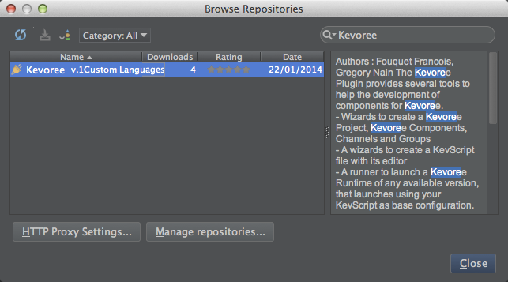

# Installation

Kevoree Plugin is distributed through the IDEA main repository, like any other plugins.

##### Requirements:

It is available since IntelliJ 13 and requires Java 1.6+. We recommend however to use JDK 1.8+.

#### Intallation process

* At startup screen (meaning main window is focus)
* Naviguate to configure menu
* Naviguate to plugins menu
* Click on Browse repositories button
* Select Kevoree plugin, click on apply and reload.

After the installation process, IntelliJ will restart. Once done, you can enjoy all Kevoree additional features.
