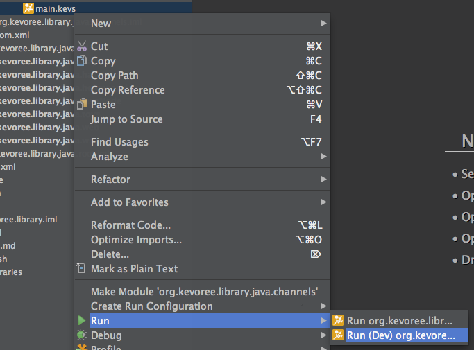
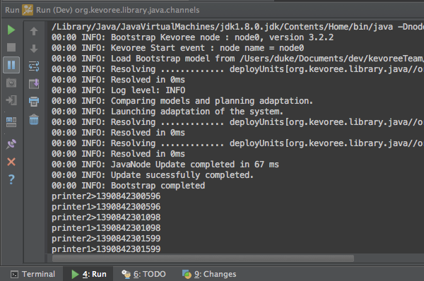
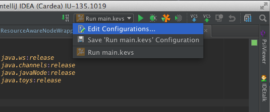
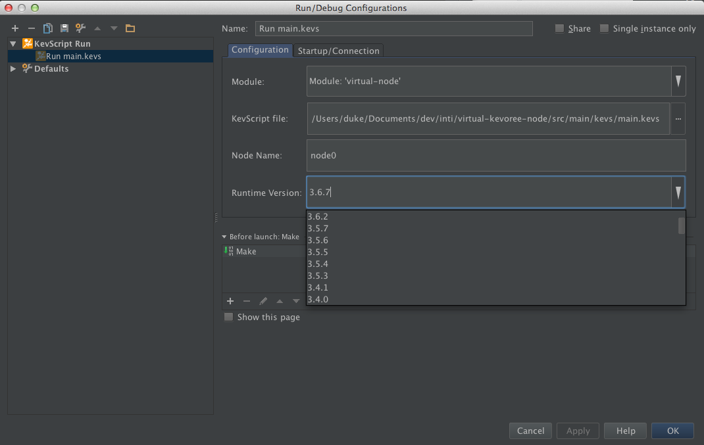

# Run Kevoree platform

KevScript files describe configurations.
Kevoree platform can then bootstrap on this configuration.
This plugin allows you to right click on any .kevs file to directly start a test platform into your IntelliJ through run menu.

Runner bootstrap with Java code from your IDE. This is the most efficient way to test the component you are developing. In addition, this runnner automatically add your type definitions from your project directly available in your KevScript, so if you forgive include statement it will have no impact. In short modify the code, run again and you will see immediatly the modification. We rely on the incremental compilation of IntelliJ.

After run you should see the resulting console result. Then you are able to start quickly your code as fast as a main method.

By default Kevoree runner look in the KevScript for a node named ***node0*** and take the last version of Kevoree runtime. If you want to adapt to your parameter you can create and customize IntelliJ runner using a menu on top right.

Using this menu, you can change default node name and set the Kevoree version as suitable to your needs.

