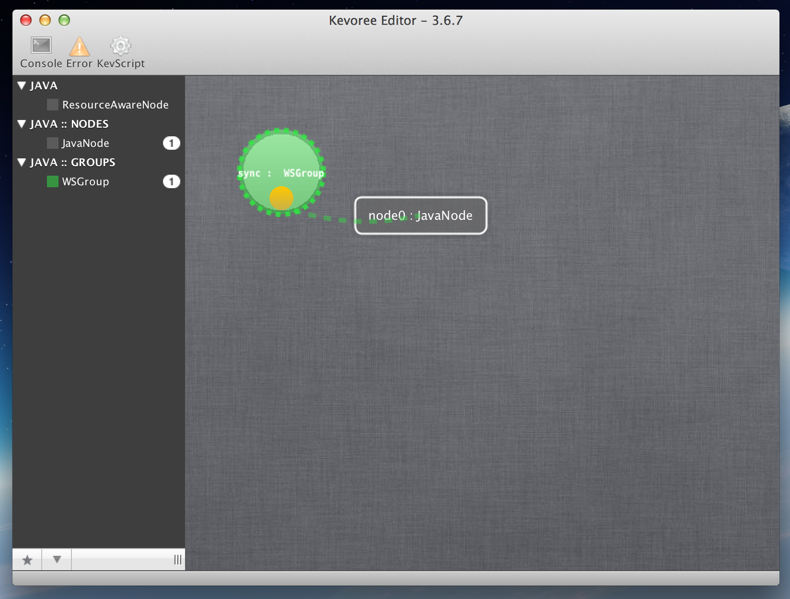

# Standalone Editor

The standalone editor is a Swing application to enable graphical representation of Kevoree model.

The editor is able to to read/write and edit model but also to ***pull*** and ***push*** model ***from*** and ***to*** a node.

The last version of the Kevoree editor can be found at the following address:

> [Download Kevoree Editor](http://oss.sonatype.org/service/local/artifact/maven/redirect?r=public&g=org.kevoree.tools&a=org.kevoree.tools.ui.editor&v=RELEASE)

Available type definitions are represented on the left side of the editor rather than on the right are depicted instances.

Users can thus modify elements, bindings ... using classical drag and drop interface.

Additionally to load a model from a node user can use the top menu (as any WIMP like interface)

> File > Load From node > (file the right IP of the node) > open

Similarly to push to model to a node, user has to clic on the node.
A property popup will appear containing a ***push*** button for this purpose.
