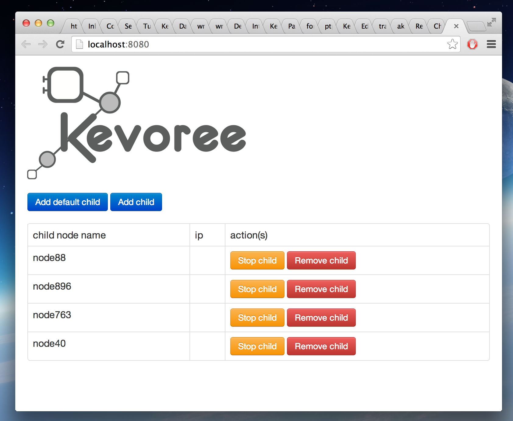

# Getting started

### Kevoree and Models
Kevoree intensively relies on models, which are structured files in JSON, used to carry the description of a component, an entire library, the location where the binary files can be found and/or the description of a software system to deploy with all the component instances and their connections.

### The Kevoree Editor

The Kevoree Editor provides an authoring tool dedicated to Kevoree Models.
It offers a Graphical Editor where Kevoree models can be intuitively designed using drag&drop mechanisms.
It also embeds a Kevoree Scripting engine developed to simplify the modifications.

1. Web Editor

  > https://editor.kevoree.org

2. Standalone Editor

  > [Download Kevoree Editor](http://oss.sonatype.org/service/local/artifact/maven/redirect?r=public&g=org.kevoree.tools&a=org.kevoree.tools.ui.editor&v=RELEASE)

### Kevoree Distributions
Kevoree offers several runtime environments (JVM, JavaScript, Android, Arduino). In particular, the Java runtime wraps a Java Virtual Machine with all the necessary features to handle the deployment of models received from editors or local components.

* Use Kevoree for Cloud developement or without installing anything on your machine :

> [Download Boot2Kevoree client](https://github.com/kevoree/boot2kevoree-cli/releases) (requirement : virtualbox) and simply start a Kevoree mini cloud using boot2kevoree-cli start

> [Download Boot2Kevoree iso](https://github.com/kevoree/boot2kevoree/releases) and use it in virtual box for instance.

* Use Kevoree for test purposes, go for Runtime GUI version :

> [Download Java Runtime w. GUI](http://oss.sonatype.org/service/local/artifact/maven/redirect?r=public&g=org.kevoree.platform&a=org.kevoree.platform.standalone.gui&v=RELEASE)

* Use Kevoree for command line usage, go for standalone JAR version :

> [Download Java Standalone](http://oss.sonatype.org/service/local/artifact/maven/redirect?r=public&g=org.kevoree.platform&a=org.kevoree.platform.standalone.gui.prompt&v=RELEASE)  
> [Install JavaScript Standalone (from npm)](https://github.com/kevoree/kevoree-js-cli)

* Use Kevoree as a Service for production deployment, go for the DEB version (for Ubuntu like server, or Raspian OS) with watchdog :

> [Download Java Watchdog](http://oss.sonatype.org/service/local/artifact/maven/redirect?r=public&g=org.kevoree.watchdog&a=org.kevoree.watchdog&v=RELEASE)

### Usage

All Kevoree Java applications can be started as follows:

`java -jar kevoreeRuntime.jar (replace kevoreeRuntime by the right name of the file)`

or simply by a double click.

To run boot2kevoree (virtualbox need to be installed http://www.virtualbox.org/), simply copy the file in your path then:

`boot2kevoree init`

This will download the .iso file and init the virtualmachine

`boot2kevoree up`

This will start the boot2kevoree virtual machine

`boot2kevoree editor`

will run the editor

`boot2kevoree ssh`

will log into the virtual machine (user:kevoree, password:tcuser)

`boot2kevoree gui`

will run the default Kevoree Cloud GUI, this will allow you to add/remove virtual machine

> The documentation of the Node.js version of the Kevoree client can be found [here](https://github.com/kevoree/kevoree-js-cli)
