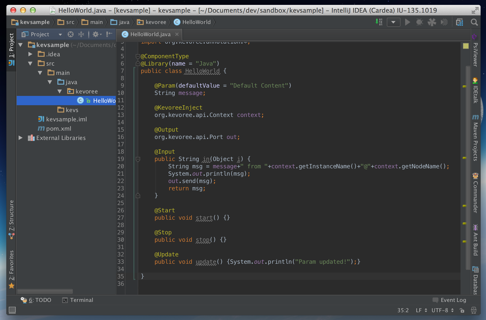
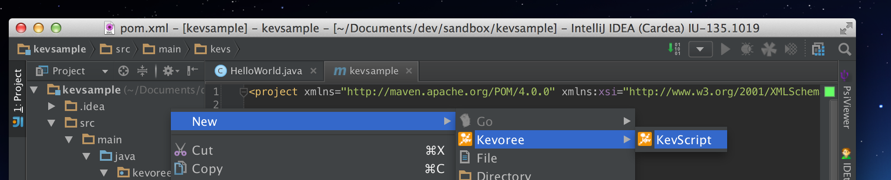
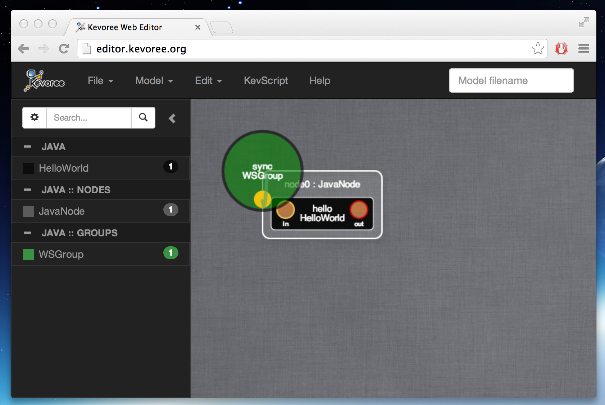

# Kevoree for the impatient

You want to see something running fast, but not only a pre-compiled demo... ok this section is a super short tutorial to do a hello world in a Kevoree developement environement.

1. Install JDK8: https://jdk8.java.net/
2. Install IntelliJ IDE : http://www.jetbrains.com/idea/download/
3. Install Kevoree Plugin in IntelliJ (Preferences > Plugins > Browser repositories > Kevoree > Install)
4. Restart IntelliJ
5. Create an Empty Kevoree Project (File > New Project > Kevoree > ok)
    
6. Update the version of Kevoree to desired one
    
7. Eventually refresh maven project if necessary
    
8. Ok you should see a demo component HelloWorld.java
    
9. Create a KevScript file in ***src/kevs***
    
10. Right and run it
    
11. Open Kevoree editor : http://editor.kevoree.org and load the current model (File > Open from node and leave everything by default)
12. Now edit the KevScript file and add the line
```
add node0.hello : HelloWorld
```
13. Run it again, and reload the model, you should see the new component inside the node.
    
14. Now add another HelloWord component using drag and drop and push the new model
    
15. You sould see a message saying that your component has been pushed.

Now feel free to modify the hello world, to connect it to several using default library of channels and so on...
