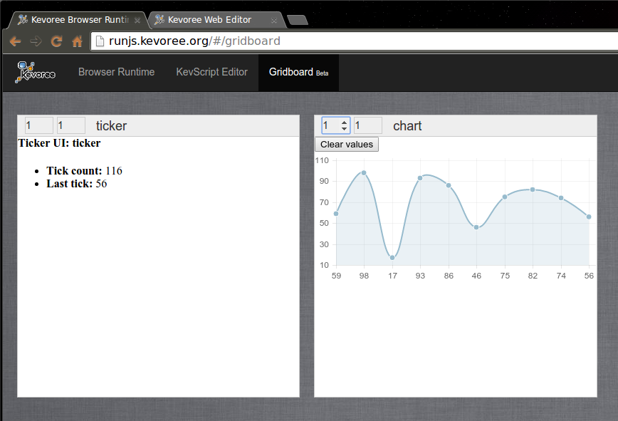
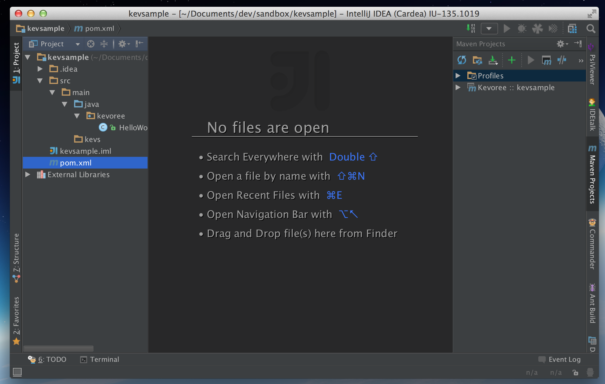

# Kevoree for the impatient

> The Kevoree Browser Runtime is still under active development; expect things to break randomly :-) Please provide feedback ([issue on GitHub](https://github.com/kevoree/kevoree-browser-runtime/issues/new)), if it breaks

### You want to see something running fast...ok

1. Open the [Kevoree Browser Runtime](http://runjs.kevoree.org)

    

2. To start a new node, juste enter a **Node name** (eg. "browser") in the first input on the right and then click on **Start my node**
  > At that point, your current browser tab is acting as a Kevoree runtime running a default **KevScript** that contains a **JavascriptNode** and a **RemoteWSGroup**

3. After a few time, you should see the logs:

    

4. Click on the **Dashboard** item in the left panel to display general informations about your runtime

    

5. You should now see a link to the **Kevoree Web Editor** that as been built using your current model.  
Follow this link

    

  > You can see that by giving some *query parameters* to the **Web Editor** URL you can automatically trigger an **Open From Node** on start-up.

  > This model is the abstraction of your currently running **Kevoree runtime** at *http://runjs.kevoree.org* on the other tab

6. The point of the **Kevoree Web Editor** is to provide an easy way to manage your **model@runtime** and then deploy it. In this tutorial, we will just add two components and a channel by using the **KevScript** language:

    ```kevs
    // copy/paste this in the KevScript Editor in Kevoree Web Editor
    add browser.ticker: Ticker
    add browser.chart: Chart
    add chan: LocalChannel

    set browser.ticker.random = 'true'
    set browser.ticker.period = '500'

    set browser.chart.xLimit = '10'

    bind browser.ticker.tick chan
    bind browser.chart.input chan
    ```

    

    Then click on **Merge** and you will see this:

    

7. The next step, is to send this new model to your running system. To do so, in Kevoree, you use the **Groups** (ie. the green circles).  
Select the group **"sync"**, this will open the instance panel on the right. At the bottom of this panel there is a **Push/Pull model** button, click it.

    

8. Select *where* you want to send your new model:

    

    > Because we use the **RemoteWSGroup** by default, you are given a pseudo unique ID. It should be displayed in the **Path** list. Just select:
      - **host**: ws.kevoree.org
      - **port**: 80
      - **path**: *your pseudo unique id* (eg. "jvclSQw" in the example)

    > And then **Push** your model.

9. Back to the **Kevoree Browser Runtime** tab, you can witness model@runtime adaptations

  

10. Go to the **Gridboard Beta** page, and you will see a grid of all the running components UIs

  

Yay.

### You want to develop your own component, here is a short tutorial to install a development environment

1. Install [JDK8](https://jdk8.java.net/)
2. Install [IntelliJ IDE](http://www.jetbrains.com/idea/download/)
3. Install Kevoree Plugin in IntelliJ (`Preferences > Plugins > Browser repositories > Kevoree > Install`)
4. Restart IntelliJ
5. Create an Empty Kevoree Project (`File > New Project > Kevoree > ok`)
    
6. Update the version of Kevoree to desired one
    
7. Refresh maven project if necessary
    
8. Ok, you should see a demo component `HelloWorld.java`
    
9. Create a KevScript file in `src/kevs`
    
10. Right click and run it
    
11. Open [Kevoree editor](http://editor.kevoree.org) and load the current model (`File > Open from node` and leave everything by default)
12. Now edit the KevScript file and add the line:
```
add node0.hello : HelloWorld
```
13. Run it again, and reload the model. You should see the new component inside the node.
    
14. Now add another HelloWord component using drag and drop and push the new model
    
15. You sould see a message saying that your component has been pushed.

Now feel free to modify the hello world, to connect it to several using default library of channels and so on...
