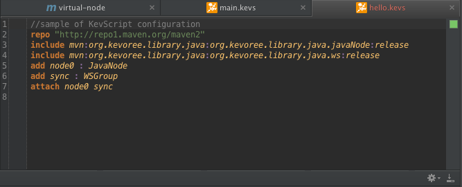
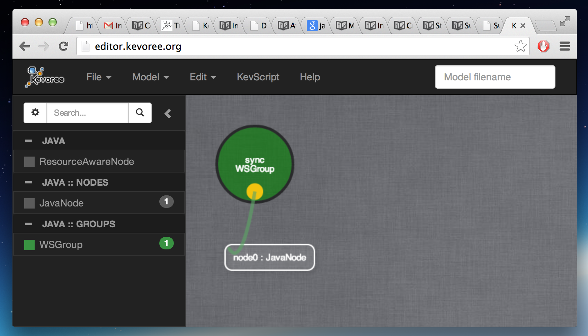

# Kevoree Script (aka KevScript)

KevScript is a scripting language developed to simplify the authoring of models at design and run-time.

  KevScript is a scripting language to manipulate a model and not a general purpose langage.

The KevoreeScriptEngine takes a script and a source model as input, and returns a new model modified according to the script.

In other word, KevScript is only a Kevoree-specific transformation language.

KevScript can be use to describe

1. A boot model
2. Action in editors
3. Adaptation from any Kevoree entities deployed into a Kevoree runtime.

In other word, KevScript is the most generic way to manipulate Kevoree models, and can be used to visualize, test, edit, and perform live adaptations.

### How it look like ?

The following figure depict a classical exemple.

The result of this script will be the creation of a model containing a node, a group and the attachement of the `node0` to the group `sync`. The graphical result is depicted in the following figure.

