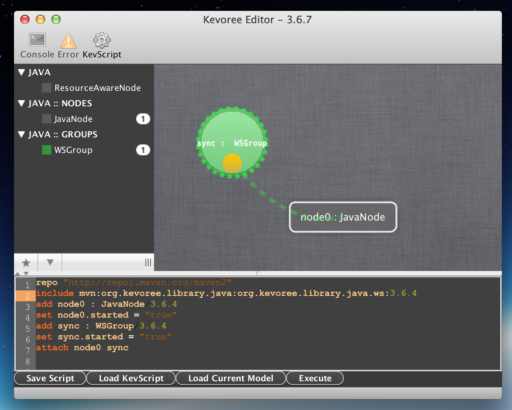
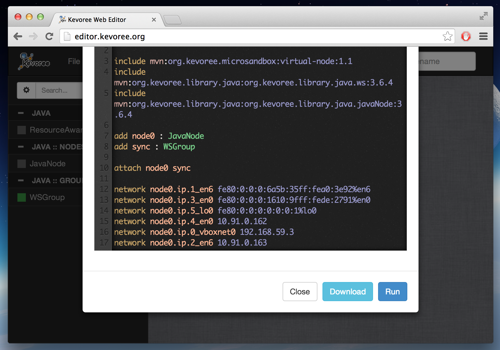

# Usages ?

First of all, KevScript (aka kevs) <span class="warning-bloc"><span class="fa fa-exclamation-triangle fa-lg orange"></span> is sequential! It means that, for instance, you have to create an instance BEFORE using it in a bind command.</span>

A script is then a sequence of actions, but not executed immediately but only opering modification on the models.
According to such definition, a classical process of ***kevs*** usage could be:

1. First, write your adaptation script. Describe the modifications you want to operate on the model.
2. Then ask for the execution of this script on a model to produce a new model.
3. Validate the result
4. Potentially deploy the new model to really adapt the system according to modification asked in the script.

Concretely, in Kevoree man can use this approach for several purpose. Namely you can execute KevScript in

**1. Standalone Editor**

To try a sequence of modifications, and validate graphically the result.



**2. Web Editor**

For the same purpose than standalone, but using the JavaScript execution engine.



**3. As initial boot configuration for a runtime**

In order to build the initial model passed to a runtime to initiate everything.

```
java -jar runtime.jar -boot.model=myModel.kevs
```
or more simply from the IntelliJ plugin, (right clic run)

**4. Plain JVM based appliation**

The KevScript execution is a plain Java library and can be used from any Java application.
The library is accesible through maven as the following code.
```xml
    <dependency>
            <groupId>org.kevoree</groupId>
            <artifactId>org.kevoree.kevscript</artifactId>
            <version>${kevoree.version}</version>
        </dependency>
```
The execution environement is then accessible through the class KevScriptEngine as follow:

```java
KevScriptEngine engine = new KevScriptEngine(modelToModify);
ContainerRoot resultModel = engine.execute("add node1 : JavaNode");
```

**5. From any Kevoree entity deployed in a runtime**

Kevoree Core module (embedded in each runtime distribution) offers an access to the deployement of KevScript actions through Kevoree API.

Any components can then access to this API and ask for execution of a script directly on a runtime to perform some adaptations.

```java
@KevoreeInject
ModelService modelService;

modelService.submitScript("add node1 : JavaNode", callback...
```
