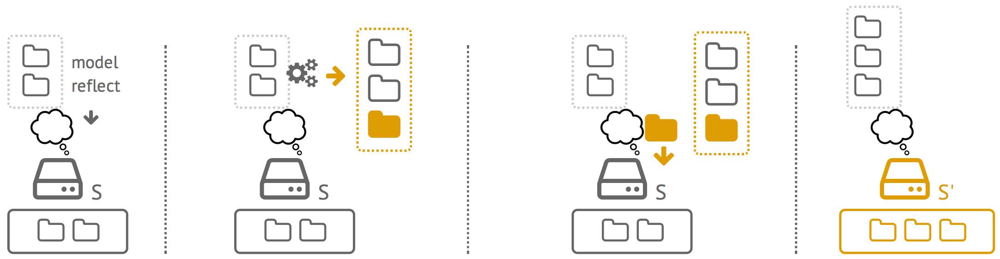
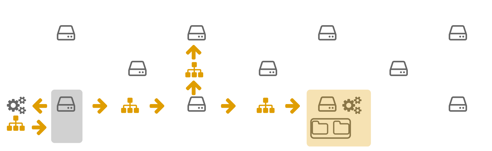
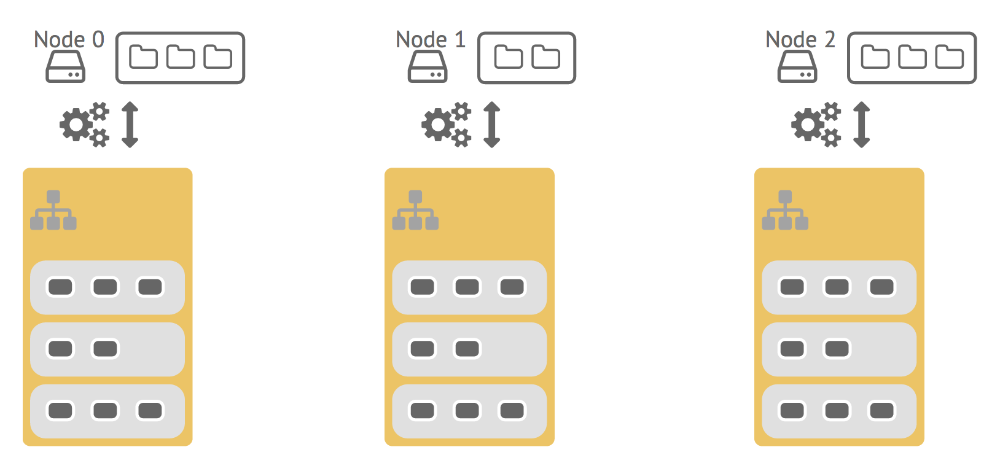

# Distributed Models@Run.time

The Kevoree project is build around the concept of Distributed Models@Run.time.
This approach aims at taming the complexity of distributed adapted systems (DDAS).

**What is complex ?**

****#Reason 1**** To perform an adaptation, a system has to know technical details about deployed elements in order to do the provisionning.

> In Kevoree we propose to interact through an abstraction layer (model) which contains only simple primitive, thus, CRUD operations on elements. As result, adaptations are simpler and the complexity is delegate to the execution place (node) which as to know technical details to be able to perform them.

**** Reason 2**** System adaptations can be complex to plannify and introspection are complex.

> In Kevoree we propose to interact asynchronously with a local model layer in order to express forseen modification. These modification are then send to a node which plan them and execute.

The principe of Models@Run.time can be explain in 4 step as depitect in the following figure:
1. A system keep an update abstract of its state (for instance reflecting that currently he host 2 component2)
2. To perform an adaptation we interact asynchrously (only by modifying the abstraction)
3. We send the model to a runtime, wich will apply the modifications (using a diff) on the system
4. The system now reflect the asked abstract, and next adaptations can be asked.

**** Reason 3**** Distributed systems are often unsynchronized due to connection failed.

> In Kevoree, we propose to interact through an asynchronous model. Thus the system will take care using different strategy to send the model to other platform asynchronously as well. As depicted in the following figure using such strategy, to adapt a cluster we just have to broadcast a model (an image of them).

### The big picture ! Kevoree in one image, ouch...

This last figure describe a distributed Kevoree architecture. Every node are executing some components (in orange) has a Models@Run.time layer, in other words, a local copy of their view of the world (in gray) containing their state and other nodes expecting states. To solve DDAS issues we thus just have to ensure that this vision is synchronized between all nodes, resulting in a global synchronization of the cluster components.

### Ok then

As a result in Kevoree if you want to deploy a web server on your neighbour phone, you just do

> getLocalModel.getNode("neighbour").add("WebServer").sync();

Now you get it, Kevoree project is himself build to build complex adaptive system, by allowing to express simply complex distributed adaptations. As result we can build clever self-healing cluster of cloud servers, ubiquitous phones cohalition, ...
