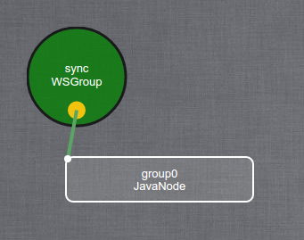

# Bootstrap
## Usage
A bootstrap is usually a command line tool which start an model.

It should be able to start an minimal model from scratch.

This default model is described in KevScript as (in java from example) :
```
add group0 : JavaNode
add sync : WSGroup
attach group0 sync
```

And looks like this in the editor :



## Dependencies
A bootstrap depends of the following kevoree components :
 * The [model](model.md)
 * The [kevscript interpreter](kevscript.md) (which transform a kevscript to a model in your platform).
 * The [remote code loader](remote_code_loader.md)
 * The [Logger](logger.md)
