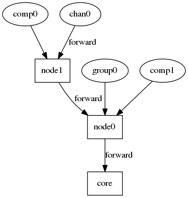

# Logger
## Format
The format of a log trace is *hh:mm:ss.fff log_level emiter message* where :
  * **hh** : The current hour in the day (24h)
  * **mm** : The current minute in the hour
  * **ss** : The current second in the minute
  * **fff** : The current millisecond in the second
  * **log_level** : The log level of the message
  * **emiter** : The unique identifier of the emiter (i.e. the unique id of the component)
  * **message** : The logged message

## Log levels :

| Name | Priority level | Comment |
|------|----------------|---------|
| TRACE | 1 | |
| DEBUG | 2 | |
| INFO | 3 | |
| WARN | 4 | |
| ERROR | 5 | |
| NONE | 6 | This level can't be used to send a message. It exists only for filtering purpose. |

## Architecture

The logging system is defined around a chain of filtering.
A component which want to send a message will actually forward it his parent in the chain which will have responsibility to determine if it will forward it through. A message is logged only if it reach the core which is the only one allowed to print a log message.

### Filtering algorithm
A message is forwarded if the local level of logging (LOCAL_LEVEL) is lower or equals to the level of the logged messages (MESSAGE_LEVEL).

>  LOCAL_LEVEL <= MESSAGE_LEVEL

For example for node1 and node0 with respectively logging levels of INFO and ERROR, if comp0 send a message with level INFO it will be forwarded by node1 but will be discarded by node0 (and consequently not printed).

But if chan0 send a message of level ERROR, it will be forwarded by both node1 and node0 and then printed by the core.
