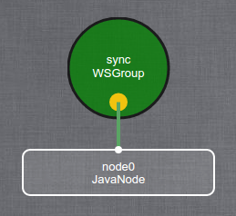

# Runtime
## Usage
A runtime is a Kevoree executable application. It is used to actually start a Kevoree core targetting a specific platform.  

Currently, Kevoree has 3 runtimes:
 - Java runtime, which is an executable JAR file. ([Download](http://oss.sonatype.org/service/local/artifact/maven/redirect?r=public&g=org.kevoree.platform&a=org.kevoree.platform.standalone&v=RELEASE))
 - Node.js runtime, which is available on [npm](https://www.npmjs.com/package/kevoree-nodejs-runtime)
 - Browser runtime, which is also targeting the JavaScript platform but runs in Web Browsers and allows components to provide a User Interface. ([Browser runtime](http://runjs.kevoree.org))


By default, every runtime must be able to start a Kevoree environment without giving any input.  In such case, the runtime must create what we call a "default bootstrap model", in KevScript this model looks like this:
```
// default bootstrap model targeting the JavaNode
add node0 : JavaNode
add sync : WSGroup

attach node0 sync
```

And in the model editor:  



## Dependencies
A runtime depends, at least, on the following Kevoree parts:
 * [core](core.md)
 * [model API](model.md)
 * [kevscript interpreter](kevscript.md)
 * [remote code loader](remote_code_loader.md)
 * [logger](logger.md)
